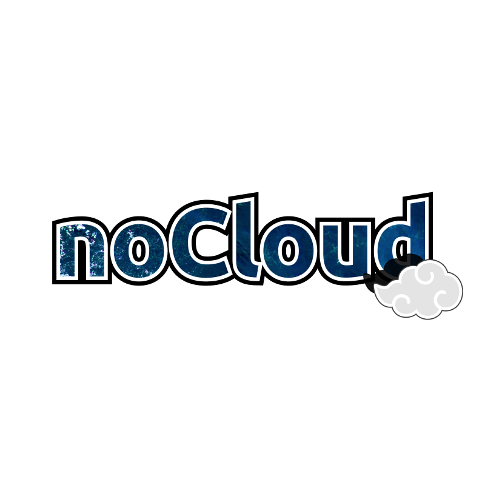

      

    <a href="#sobre">Sobre</a>  |
    <a href="#backlogs">Backlogs, Épicos & User Stories</a>  |
    <a href="#tecnologias">Tecnologias</a>  |
    <a href="#equipe">Equipe</a> |
    <a href="#links">Links úteis</a>

## :bookmark_tabs: Sobre o projeto

Em parceria com a empresa Visiona, o projeto visa desenvolver uma aplicação mobile integrada à computação em nuvem, com foco no mapeamento automático de nuvens e sombras de nuvens em imagens capturadas pelo sensor WPM, a bordo do satélite CBERS4A. Essa aplicação tem como objetivo fornecer máscaras de nuvens de alta precisão para as imagens adquiridas, facilitando o monitoramento e a análise de diversas áreas de interesse no Brasil.

## :warning: Problemática

A ausência de máscaras de nuvens nas imagens do satélite CBERS4A/WPM limita a capacidade de análise de grandes volumes de imagens em áreas extensas, especialmente em regiões tropicais com alta cobertura de nuvens. Quando realizado manualmente, esse processo é custoso e demorado, dificultando a automação de procedimentos em aplicações que exigem alta precisão e eficiência.

## :white_check_mark: Proposta de Solução

Desenvolvimento de um serviço e uma aplicação mobile em nuvem que automatiza o mapeamento de nuvens e sombras de nuvens em imagens do satélite CBERS4A/WPM, utilizando modelos de Deep Learning. A solução permitirá a definição de área e período de interesse, acesso às imagens correspondentes, mapeamento automático de nuvens e sombras, visualização dos resultados em uma interface de mapas, e download das máscaras em formato vetorial. Isso tornará o processo de análise mais eficiente, preciso e acessível para os usuários.

:pushpin: Status do Projeto: **🚧 Em andamento**

## 🏁 Entregas de Sprints

Cada entrega será realizada a partir da criação de uma **tag** em cada repositório (Front, Back), além da criação de uma branch no repositório da documentação com um relatório completo de tudo o que foi desenvolvido naquela sprint. Observe a relação a seguir:
| Sprint | Previsão de entrega | Status | Histórico |
|:--:|:----------:|:-------------------|:-------------------------------------------------:|
| 01 | 29/09/2024 | ✔️ Concluída| [Ver relatório](https://github.com/noCloud-Visiona/documentation/releases/tag/SPRINT_1) |
| 02 | 20/10/2024 | ✔️ Concluída| [Ver relatório]() |
| 03 | 10/11/2024 | ✔️ Concluída| [Ver relatório](https://github.com/noCloud-Visiona/documentation/releases/tag/SPRINT_3) |
| 04 | 01/12/2023 | 🚧 Em andamento| [Ver relatório]() |

<!--# 🚧 Em andamento -->
<!--# ✔️ Concluída -->

→ [Voltar ao topo](#topo)

# :dart: Backlogs, Épicos & User Stories

## Backlog

| **Sprint** | **MVP** |
|------------|---------|
| Sprint 1   | Tela de Login e Autenticação Básica, onde o usuário pode fazer login com suas credenciais e acessar a aplicação. |
| Sprint 1   | CRUD de usuário, possibilitando cadastro, edição, exclusão e visualização de dados dos usuários. |
| Sprint 1   | Primeira versão funcional do algoritmo de identificação de nuvens e sombras em uma imagem de satélite enviada pelo usuário. |
| Sprint 1   | Exibição do histórico de análises de imagens do usuário, permitindo visualizar as análises passadas. |
| Sprint 2   | Funcionalidade para atualizar e excluir descrições das imagens analisadas no histórico do usuário. |
| Sprint 2   | Consumir a API do INPE para buscar imagens com base na localização e data escolhida pelo usuário. |
| Sprint 2   | Serviço de download da imagem processada em formato PNG e geração de um PDF contendo os detalhes da análise. |
| Sprint 3   | Exibir diferentes camadas da imagem (sem nuvens, com nuvens, com sombras) para uma análise mais precisa. |
| Sprint 3   | Visualizar as imagens analisadas georreferenciadas em um mapa interativo. |
| Sprint 4   | Refatoração final, correções de bugs e preparação para o deploy em produção. |

---

## Requisitos Funcionais

| **ID**   | **Descrição** |
|----------|---------------|
| RF01     | O sistema deve permitir que o usuário faça login com suas credenciais (e-mail e senha). |
| RF02     | O sistema deve permitir o cadastro de novos usuários, além de edição e exclusão de contas existentes. |
| RF03     | O sistema deve permitir que o usuário faça o upload de imagens de satélite para análise de nuvens e sombras. |
| RF04     | O sistema deve exibir o histórico de análises de imagens do usuário, com opção de edição e exclusão. |
| RF05     | O sistema deve consumir a API do INPE para buscar imagens de satélite com base na localização e data selecionada pelo usuário. |
| RF06     | O sistema deve permitir o download da imagem processada em formato PNG e de um PDF contendo informações da análise. |
| RF07     | O sistema deve exibir diferentes camadas da imagem analisada (sem nuvens, com nuvens, com sombras) para uma análise detalhada. |
| RF08     | O sistema deve mostrar as imagens analisadas georreferenciadas em um mapa interativo. |

## Requisitos Não Funcionais

| **ID**   | **Descrição** |
|----------|---------------|
| RNF01    | O sistema deve garantir a segurança das credenciais de login, utilizando criptografia para armazenar senhas. |
| RNF02    | O sistema deve ser responsivo, funcionando tanto em dispositivos móveis quanto em navegadores web. |
| RNF03    | O sistema deve processar e responder as requisições do usuário dentro de um tempo máximo de 5 segundos. |
| RNF04    | O sistema deve ser compatível com diferentes navegadores (Chrome, Firefox, Safari). |
| RNF05    | O sistema deve garantir alta disponibilidade, com tempo de inatividade inferior a 1% por mês. |
| RNF06    | O sistema deve armazenar dados das análises de imagens em um banco de dados não relacional (ex: MongoDB ou Firebase). |
| RNF07    | O sistema deve ter suporte a até 10 mil usuários simultâneos. |

---

## User Stories

| **US**   | **Atores**        | **Ação**                                              | **Motivo**                                                    |
|----------|-------------------|-------------------------------------------------------|---------------------------------------------------------------|
| US01     | Usuário Comum      | Realizar login na aplicação                           | Para acessar as funcionalidades da aplicação.                  |
| US02     | Administrador      | Gerenciar usuários (criar, editar, excluir)           | Para manter os dados dos usuários atualizados.                 |
| US03     | Usuário Comum      | Fazer upload de imagens de satélite                   | Para analisar nuvens e sombras nas imagens.                    |
| US04     | Usuário Comum      | Visualizar histórico de análises                      | Para acessar análises passadas e gerenciar as imagens.          |
| US05     | Usuário Comum      | Editar e excluir descrições de análises               | Para manter o histórico de análises atualizado.                |
| US06     | Usuário Comum      | Buscar imagens por localização e data                 | Para encontrar imagens específicas para análise.                |
| US07     | Usuário Comum      | Fazer download da imagem processada e de um relatório | Para obter cópias locais das análises feitas na plataforma.     |
| US08     | Usuário Comum      | Visualizar diferentes camadas da imagem analisada     | Para analisar mais detalhadamente nuvens e sombras.             |
| US09     | Usuário Comum      | Visualizar as imagens georreferenciadas no mapa       | Para identificar a localização exata das imagens analisadas.    |
| US10     | Administrador      | Fazer deploy da aplicação                             | Para disponibilizar a aplicação ao público de forma estável.    |

→ [Voltar ao topo](#topo)

# 🛠️ Tecnologias

Linguagens, bibliotecas e tecnologias utilizadas na construção do projeto:

→ [Voltar ao topo](#topo)

# :busts_in_silhouette: Equipe

|    Função     | Nome                           |                                                                                                                                                      LinkedIn & GitHub                                                                                                                                                      |
| :-----------: | :----------------------------- | :-------------------------------------------------------------------------------------------------------------------------------------------------------------------------------------------------------------------------------------------------------------------------------------------------------------------------: |
|   Product Owner    | Thiago Frederico da Silva Zani |                    |             
| Scrum Master | Jean Lucas de Faria Silva      |                    |             
|   Dev Team    | Gabriel Brosig Briscese        |       |
|   Dev Team    | Jonas Rafael Siqueira Ribeiro      |                           |
|   Dev Team    | Jonatas Mathias Dalló     |                    |
|   Dev Team    | Miguel Carvalho Soares     |                    |

→ [Voltar ao topo](#topo)

# :link: Links úteis

- [Repositório Frontend](https://github.com/jeejdev/frontend-nocloud)

- [Repositórios Backend:]()
  - [Cadastro-Autenticação](https://github.com/jeejdev/controller-cadastro-autenticacao-nocloud)
  - [Identificação IA](https://github.com/jeejdev/controller-identificacao-ia-nocloud)

- [Repositório Banco de Dados](https://github.com/jeejdev/controller-firebase-nocloud)

- [Fatec "Profº Jessen Vidal" SJCampos](https://fatecsjc-prd.azurewebsites.net/)

- [Visiona Tecnologia Espacial](https://visionaespacial.com/empresa/)

    

  → [Voltar ao topo](#topo)
